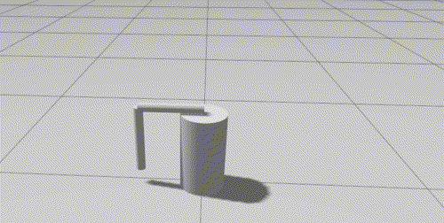

# Furuta Pendulum

LQR, MPC and RL approaches to control the Furuta pendulum in simulation.

<p align="center">
  
</p>

Packages in this repository can be divided into two subgroups: 

1. Different approaches to solving the control problem:
 * **furuta_pendulum_de** - uses manually derived Differential Equations (hence the name) with manually calculated linearization, which is then used for calculating gains for the LQR controller with swing-up
 * **furuta_pendulum_drake** - in this package the same LQR with a swing-up approach is used, but this time manually derived equations are replaced. Instead [Drake library](https://drake.mit.edu/) is used to load the URDF of the pendulum, and solely based on it, linearization is calculated, which is once again used to calculate K gain.  
 * **furuta_pendulum_control_toolbox** - in this approach different library is used - [Control Toolbox](https://github.com/ethz-adrl/control-toolbox). It also automatically derives a simulation of the pendulum based on this model (which is in the form of code generated based on the URDF model). There are two approaches used here, one is the same, as in previous ones - LQR with swing-up, but this time Control Toolbox is used to get K. Another approach uses MPC to get an optimal solution.
 * **furuta_pendulum_rl** - in this package Reinforcement Learning approach is used. The pendulum is modeled in the Mujoco, which then is used to create a Gym environment. After training the agent, the actor's network is exported to the final controller, which is implemented in C++.

2. General utility packages:
 * **furuta_pendulum_bringup** - general launch files, which combine controllers from different packages, with different simulation environments.
 * **furuta_pendulum_description** - URDF of the pendulum and config file with physical properties
 * **furuta_pendulum_gazebo** - simulation config in Gazebo, which uses ros2_control with torque control

## Building
Some of the source dependencies are specified in the `*.repos` files, you can use them by calling `vcs import src < src/furuta_pendulum/furuta_pendulum.repos` in the src directory (depending on your build you should additionally import *simulation* or *hardware* dependencies).
Some packages require installing additional dependencies if they can't be installed easily with rosdep. I usually add them to the devcontainer, but I didn't have time to automate all of them, so you may have to do it manually, for details refer to the README file of each package.

<!-- OCS2 needs release to work fast enough -->
```
colcon build --cmake-args -DCMAKE_BUILD_TYPE=Release --symlink-install
```

## Usage
To run the pendulum simulation use one of the launch files from **furuta_pendulum_bringup**, launch files have the naming convention:

*simulator_type*\_with\_*controller_type*.launch.py

Available simulator_types:
 * `gazebo`
 * `de_simulation`

Available controllers:
 * `de_controller`
 * `drake_controller`
 * `ct_controller`
 * `rl_controller`
